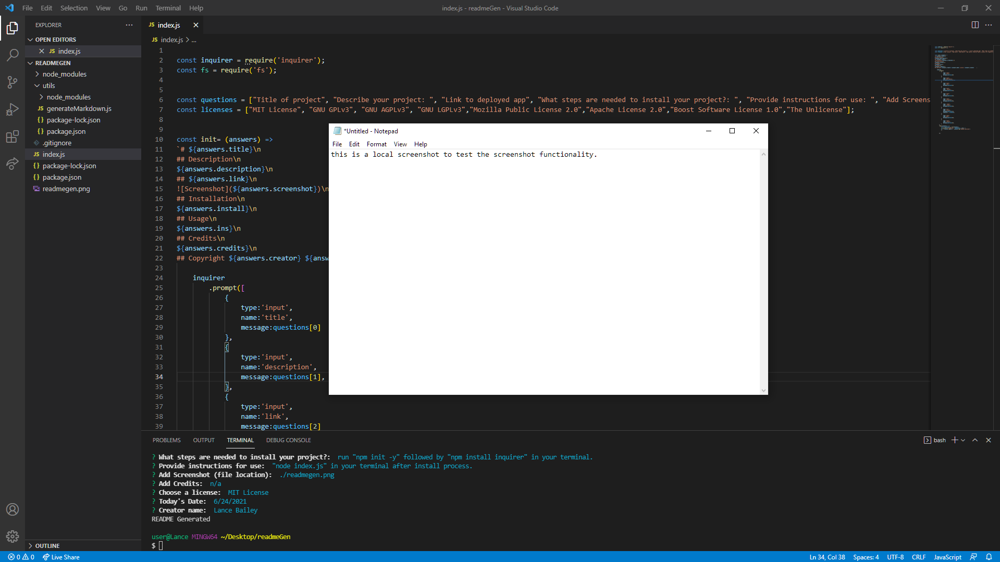

# readMEGen

## Description

a node application to expedite the tedious task of creating readme files.
    
## https://www.github.com/lancebailey26/readMEGen

## Installation

install node, then run "npm init -y" followed by "npm install inquirer" in your terminal.

## Usage

run "node index.js", complete the form.

## Credits

n/a

## Copyright Lance Bailey 6/24/2021 License: MIT License